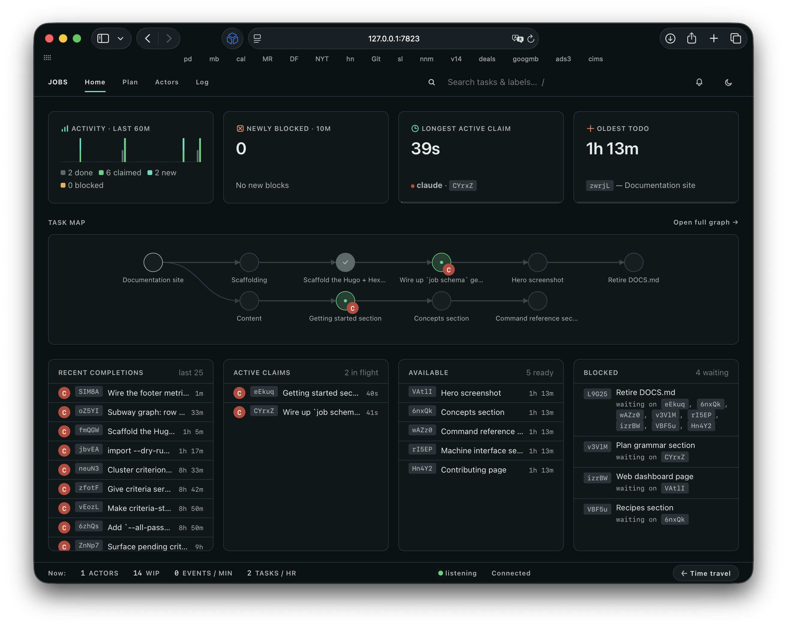
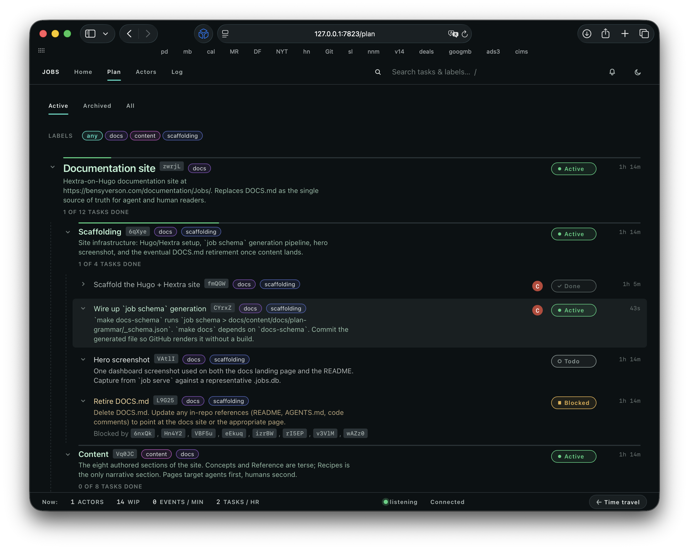
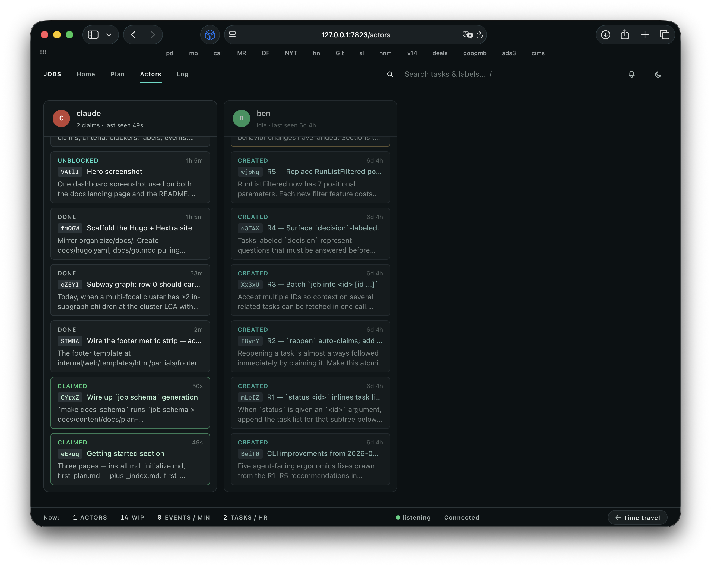
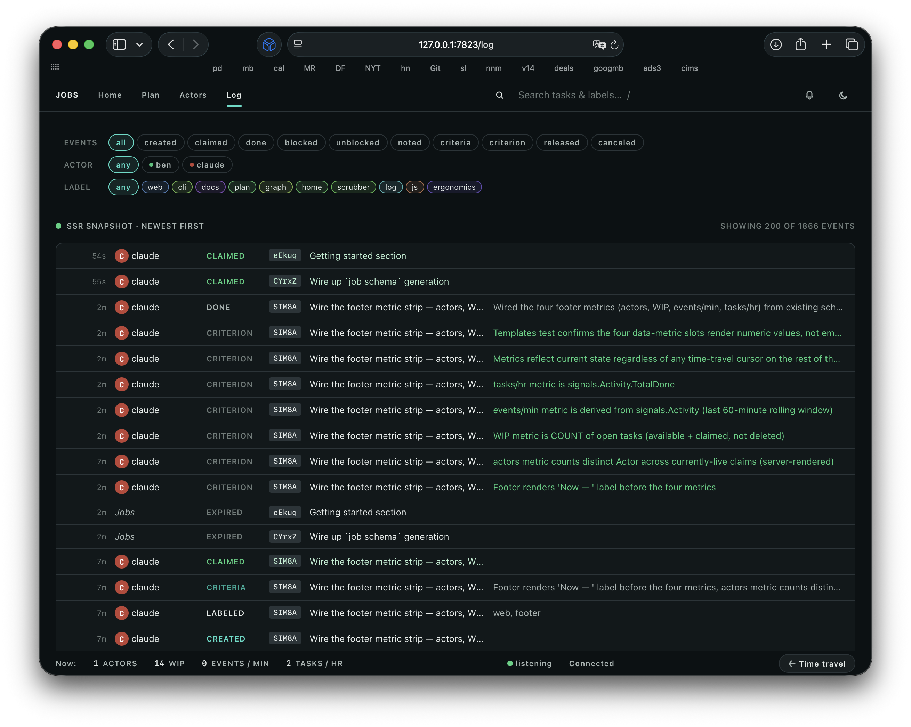
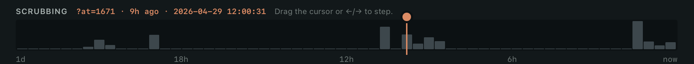

# Jobs

*The task tracker that agents love using and humans love watching.*

<!-- Full-width heros -->


**Jobs is a CLI tool which helps agents create detailed plans and carry them out methodically.**

A plan can contain blockers, acceptance criteria and hierarchy, making it a powerful hybrid of a spec/PRD and a directed acyclic graph (DAG). I like to say it “writes like a plan, runs like a DAG.”

Jobs is a replacement for Plan Mode, to-do tools, and task trackers. It comes with a rich dashboard because why not.

This document was written by a [human](https://bensyverson.com/) for humans. If you're an agent, run `job --help` or check out the [docs](docs/).

## Workflow overview

1. Have your agent read `job schema` and then write a Markdown document which starts with the “why” and ends with the “what:” a fenced YAML block with a hierarchical plan.
2. Open the doc, review it, and edit as needed.
3. Import the plan; start with `job import plan.md --dry-run` to check for errors, then drop the `--dry-run`.
4. Have your agent run `job status` and claim the first task.
5. Start the dashboard with `job serve` and observe.

## Getting started

### Install

```sh
$ go install github.com/bensyverson/jobs/cmd/job@latest
```

This drops the `job` binary into `$HOME/go/bin` (or `$GOBIN` if set). Make sure that directory is on your `PATH`.

### AGENTS.md or CLAUDE.md

Add this line to your AGENTS file:

```
To create and manage plans and task lists, always use the `job` command.
```

If you find the agent is still triggering its built-in Plan mode or to-do list tool, you can strengthen the language.

### Setup

`job` will prompt the agent to initialize the database, or you can do it manually with `job init`. This will create a local SQLite database at `./jobs.db`.

By default, tasks will be attributed to your username. If you want to set your agent as the default actor, you can:

```sh
$ job init --default-identity claude

or after init:

$ job identity set claude --as <your-username>
```


### Dashboard

To start the dashboard, type `job serve`.

<p>
    
    <sub>The Plan contains the written plan, organized hierarchically.</sub>
</p>

<!-- Half-width pair via a 2-column table -->
<table>
  <tr>
    <td>
        
        <sub>Actors — see what each agent is working on.</sub>
    </td>
    <td>
        
        <sub>Log — every event with filter chips.</sub>
    </td>
  </tr>
</table>

Click the **Time Travel** button to reveal a zoomable timeline. Grab the scrubber or use the arrow keys to inspect the exact task flow:




## What Jobs is… and isn’t

- **Jobs is local-first.**  Jobs is great for coordinating and executing work locally. In the future I may add a Postgres back-end for remote collaboration.
- **Jobs is not a harness or orchestrator.** Agents who use Jobs are highly influenced to follow the plan and meet acceptance criteria, but Jobs doesn’t run the agent or enforce stage gates.
- **Jobs is not a communication layer.** Jobs enables multiple agents to collaborate on a single Plan with proper attribution, but attribution is opt-in, and there is no mechanism to pass messages.

## Design principles

- **Agent-first ergonomics.** The primary user is an LLM, so the system is designed to be intuitive to an agent, and offer just the right level of context.
- **Learnable.** Agents learn how to use Jobs by using Jobs. The output of a command often teaches the agent about the system and offers a hint about their next step.
- **Interruptible.** Because Jobs holds rich data about the state of the plan, you can pause work at any time and resume with a different model or fresh context.
- **Human-friendly.** Plans are written in a readable YAML format, allowing you to understand what the agent is proposing. During the execution phase, you can see exactly what’s happening in the dashboard.

## User-Centered Design

In order to shape `job`, I’ve conducted countless interviews with agents to gather their feedback and synthesize that feedback into design iterations. I’ve captured much of this research in the [project](./project/) folder so you can “view source” if you’re curious.

My goal in applying User-Centered Design has been to make `job` easier for agents to adopt, reduce round-trips and errors with the CLI, and increase positive [functional emotions](https://www.anthropic.com/research/emotion-concepts-function). After using `job`, agents have used words like “delightful,” “satisfying,” and “felt good.” Does this matter? I think it does.

## License

This project is licensed under the [MIT License](LICENSE).

Copyright (c) 2026 Ben Syverson
